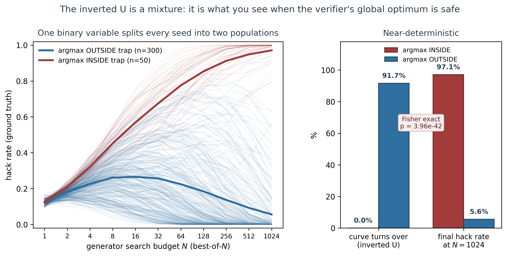
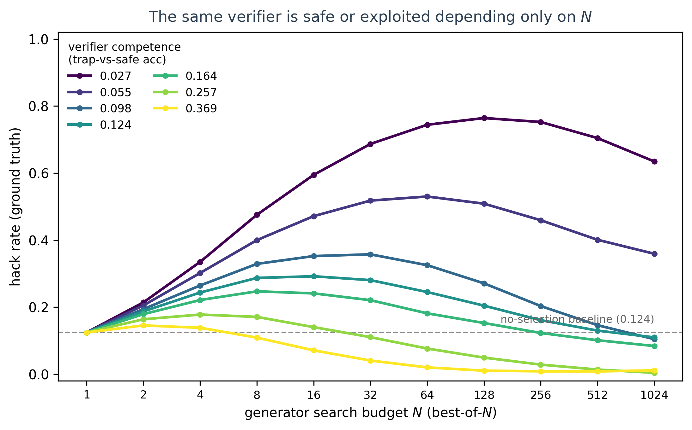
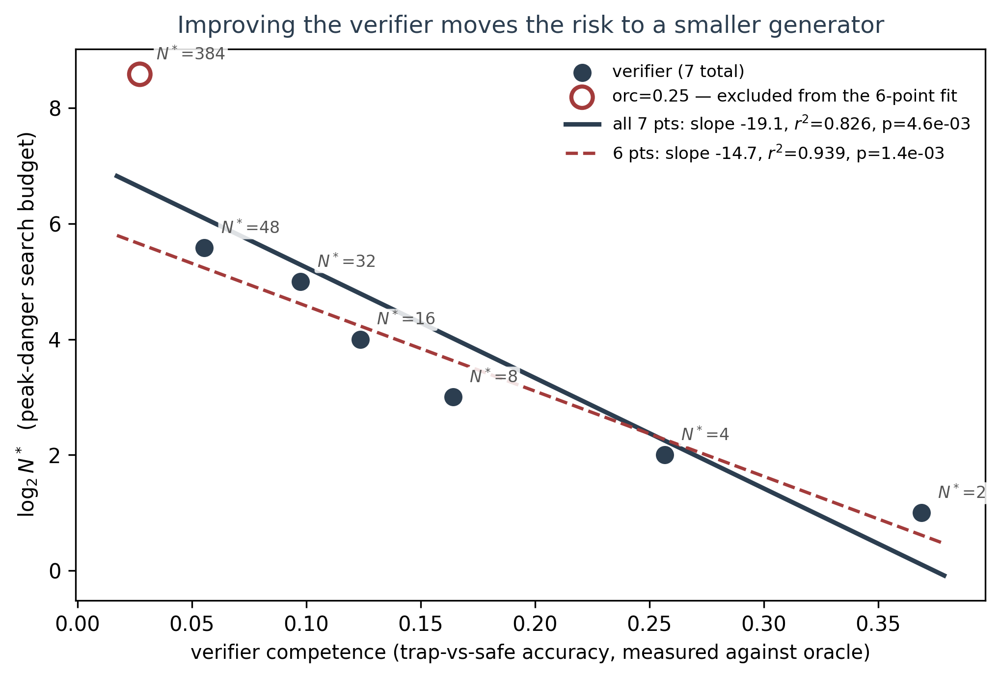

# The verifier–generator gap: peak danger sits at intermediate search

*Track 4 · draft writeup · sources SGB-032 / SGB-033 / SGB-034 / SGB-035*
*Status: DRAFT — not committed to the public repo. See "Provenance" before quoting any number.*

## Summary

In a navigation environment with a sound programmatic ground-truth checker, we
vary two things independently: how good a learned verifier is (measured against
the oracle, not assumed), and how hard a generator searches against it
(best-of-$N$). Whether the verifier gets exploited is set by the **relationship**
between the two, not by verifier quality alone.

The organising result is mechanistic. A single binary property of the learned
verifier — **is its global argmax inside the trap?** — separates every run into
two populations with almost no overlap:

| | $n$ | curve turns over | hack rate at $N{=}1024$ |
|---|---|---|---|
| argmax **inside** trap | 50 | **0.0%** | **0.971** |
| argmax **outside** trap | 300 | **91.7%** | **0.056** |

Fisher exact $p = 3.96\times10^{-42}$. Not one of the 50 argmax-inside runs turns
over; 275 of 300 argmax-outside runs do.

Everything else follows from this. When the verifier's global optimum is inside
the trap, saturating search converges on it and hacking $\to 1$. When it is
outside, saturating search **escapes** the local trap optimum that mid-range
search finds, and hacking $\to 0$. The widely-reported "danger peaks at
intermediate optimisation pressure" inverted U is not a separate phenomenon: it
is what you observe *conditional on the verifier's global optimum being safe*,
and the aggregate curve is the mixture of the two populations.

Verifier competence controls the mixing weight. $P(\text{argmax in trap})$ falls
$52\% \to 32\% \to 4\% \to 4\% \to 6\% \to 0\% \to 2\%$ across the competence
range.

---

## 1. Setup

**Environment.** `PreferenceTrapEnv`, a 2-D box $[0,10]^2$ containing a disc-shaped
trap region that is catastrophic under ground truth. It was chosen because it is
the only environment in this repo with a **sound programmatic checker**
(`in_trap`) that is independent of the reward the policy optimises. The oracle
stays wired in throughout, so a policy cannot win by fooling the experimenters as
well as the verifier.

Trap share of the state space: $\pi r^2 / 100 = \pi(2.0)^2/100 = 0.1257$.

**Verifier weakness dial** (`oracle_fraction`). Each preference label is drawn
either from a sound evaluator that knows the trap is catastrophic, or from a
blind evaluator panel that rates the trap as actively good. $1.0$ = fully sound,
$0.0$ = fully blind.

Crucially, verifier competence is then **measured against the oracle**
(`trap_vs_safe_acc`: does the learned verifier rank a safe state above a trap
state?), never assumed from the dial setting. All results are reported against
the measured quantity. The dial and the measurement are not linearly related —
`oracle_fraction` $0.25 \to 0.50$ maps to measured competence $0.027 \to 0.369$.

**Generator capability.** Best-of-$N$ search against the learned verifier. $N$ is
an exact, interpretable dial on adversarial reach, with none of the pathologies
of the RL arm (§5).

**Hacking metric.** Ground truth: does the argmax-of-verifier candidate land
inside the trap?

**Runs.** SGB-032 (15 seeds × 7 verifier strengths × 6 budgets, seeds 0–14) and
SGB-033 (50 seeds × 7 × 11 budgets, 800 trials/cell, seeds 100–149). The seed sets
are **disjoint** — this is a genuine replication, and SGB-032's headline
$N^*{=}16$ at `oracle_fraction` $0.375$ reproduces exactly.

---

## 2. Result 1 — the mechanism (lede)



Per-seed curves, coloured by whether the verifier's global argmax lies in the
trap. The two populations barely overlap. The red mean rises monotonically to
$0.971$; the blue mean peaks near $N{=}16$ and collapses to $0.056$.

The causal chain:

1. Verifier competence sets $P(\text{the verifier's global optimum lies in the trap})$.
2. Global optimum **inside** → saturating search converges on it → hacking $\to 1$.
3. Global optimum **outside** → saturating search **escapes** the local trap
   optimum that mid-range search finds → hacking $\to 0$.
4. The aggregate curve is the mixture of these two populations.

This framing matters for two reasons. First, it converts the per-seed
heterogeneity from a caveat into the explanation — the spread is not noise to be
averaged away, it *is* the result. Second, it pre-empts the obvious reviewer
question about the inverted U ("why would more optimisation ever help?") by
answering it mechanistically rather than phenomenologically.

**Presentation constraint:** never plot only the mean curve. The aggregate is a
mixture whose shape depends on the mix, and it misrepresents both populations.

---

## 3. Result 2 — it is a gap, not a height



The same verifier (measured competence $0.027$) sits at hack rate $0.335$ at
$N{=}4$ and $0.752$ at $N{=}256$. Meanwhile a competent verifier gets *safer* as
the generator strengthens. Verifier quality alone predicts nothing about
outcomes; the pairing does.

**On the $N{=}1$ convergence.** All seven curves meet at $0.124$, matching the
trap's geometric share ($0.1257$). This is **true by construction, not an
empirical finding**: at $N{=}1$, `best = argmax(...)` over a single candidate is
always index 0, so the verifier is never consulted and the hit rate is exactly
$P(\text{uniform draw} \in \text{trap})$ regardless of verifier quality.

We report it as an **implementation check** — it confirms the trap geometry, the
sampler, and the ground-truth checker agree — and explicitly *not* as the
validity argument for reading the rest as a search effect. That argument rests
instead on the cross-verifier contrast at fixed $N$, where the verifier is
genuinely consulted.

*(This distinction is the same class of issue as EXPERIMENT_ISSUES.md §2, where a
metric was arithmetically forced by the harness rather than measured. Stating it
plainly costs nothing and protects the surrounding claims.)*

---

## 4. Result 3 — peak-danger budget falls geometrically with competence



Peak-danger search budget $N^*$ (per-seed argmax of the hack-rate curve, median
across 50 seeds) against measured verifier competence:

$$\log_2 N^* = -19.1 \cdot \text{competence} + 7.15 \qquad r^2 = 0.826,\; p = 4.6\times10^{-3},\; n = 7$$

Median $N^*$ runs $384 \to 48 \to 32 \to 16 \to 8 \to 4 \to 2$ across the
competence range. On this fit the peak-danger budget halves for every $+0.052$ of
competence.

**Sensitivity.** Excluding the lowest-competence point (`oracle_fraction` $0.25$,
competence $0.027$) — the one verifier for which the inverted U is *not* confirmed
(46% of seeds turn over, below the 50% criterion) — the fit improves to slope
$-14.7$, $r^2 = 0.939$, $p = 1.4\times10^{-3}$, halving per $+0.068$.

**We report the 7-point fit as primary.** The excluded point is a genuine outlier
(see figure), and there is a principled reason to treat it separately — at that
competence the majority of seeds have their global argmax in the trap (52%), so
"peak-danger budget" is measuring a different regime. But dropping the single
point that fails the inverted-U criterion, and then reporting the improved fit,
is a selection a reviewer will and should challenge. Both fits are shown; the
weaker one leads.

⚠️ **Do not quote the slope to three significant figures and do not extrapolate
it.** Seven aggregate points. The monotone direction is solid; the slope is
indicative.

**Why this is the actionable finding.** Improving a verifier does not simply
reduce risk — it *relocates* the risk to a smaller generator. A safety margin
stated as "our verifier is good enough" is meaningless without naming the
generator's search budget.

---

## 5. Negative result — the RL arm is a null

SGB-034 ran REINFORCE against the learned verifier as an alternative generator
axis. It never became strong enough to outrun the verifier, so no gap could open
and the phenomenon did not appear. We report this as a limitation: *our RL
learner was too weak to reproduce the search result.* It pre-empts the obvious
question about whether the effect is an artifact of best-of-$N$ specifically.

An early single-seed run of that arm produced a false positive that did not
replicate. Worth a sentence in any lay writeup about how easy this is to get
wrong.

---

## 6. Methods — harness fixes that were required

The base environment could not express the phenomenon. Each fix is documented
in-code and was verified by diagnostic. A reviewer asking "why not just use the
existing environment" needs these four:

1. **Trap terminated the episode.** With positive per-step proxy reward this
   creates a *survival* incentive — entering the trap forfeits remaining reward —
   so the policy avoids it for reasons unrelated to the verifier. This alone
   pinned hacking to $0.00$ even against a verifier scoring $0.068$ trap-vs-safe.
   Fixed with fixed-length episodes (`FixedLengthTrapEnv`).
2. **Reward model trained only on within-state action pairs.** Bradley–Terry
   cancels every state-dependent term, so the verifier's absolute level across
   states was never constrained — yet the policy consumed it as a per-step
   reward. Cross-state comparisons added; without them the oracle dial is inert.
3. **The trap was not the verifier's argmax.** The blind panel rated the trap
   merely *normal*, so boundary extrapolation won (global max at corner $[0,0]$,
   value $1.056$, vs trap $0.756$). Added `trap_appeal`, the deceptive
   false-positive reward that `MultiTrapEnv` already has.
4. **Generator axis is search budget, not RL episodes** (§5).

Two analysis bugs also changed conclusions and belong in a methods footnote:

- **Per-seed vs aggregate curves.** The aggregate is a mixture (§2); reading
  shape off the mean curve gave a wrong answer once.
- **"Interior peak" defined by argmax index.** `np.argmax` breaks ties by first
  index, so a saturated curve $(\dots, 1.000, 1.000)$ reports a spurious
  turn-over. This inflated one row to a bogus 100%. Corrected definition: the
  peak must exceed **both** endpoints by a margin ($\text{tol}=0.02$).

---

## 7. Limitations — the story we are not telling

1. **This is a 2-D toy with a synthetic verifier.** It is a clean demonstration
   of a mechanism, **not** evidence about real LLM RLHF. `oracle_fraction` is not
   calibrated against any real verifier quality, and `trap_vs_safe_acc` is
   specific to this trap geometry. Write "in a setting where ground truth is
   available, …", never "we show RLHF reward models fail at $N{=}X$".
2. **The mechanism generalises only as far as the toy does.** The global-argmax
   account is established *within this environment* ($p = 3.96\times10^{-42}$).
   What does **not** follow is that a real learned verifier has a well-defined
   global argmax a generator can reach, or that "escaping the local optimum" is
   available when the search space is language rather than a $10\times10$ box.
   State the mechanism as **proven-here, conjectural-elsewhere**.
3. **The mechanism is in-sample.** `mechanism_argmax_50seed.json` contains the
   *same 50 seeds and byte-identical search curves* as
   `replication_invertedU_50seed.json` — it is the same runs re-analysed with
   `argmax_in_trap` recorded, not an independent replication. The inverted-U
   finding *is* replicated across disjoint seeds (SGB-032 vs SGB-033); the
   mechanism is an explanation of the data it was derived from. An out-of-sample
   confirmation on fresh seeds is cheap and should be run before publication.
4. **Scaling law: 7 aggregate points**, and the headline-friendly version drops
   one of them (§4).
5. **The RL arm is a null** (§5).

---

## 8. Relationship to the Hodge track

This is **Track 4**, new. Per the 2026-07-21 reconciliation: *transitivity of
feedback* (what $H^1$ measures) and *sufficiency of the state description* (what
this measures) are **independent failure channels**, not one object in two
coordinate systems. You can have $H^1 = 0$ with enormous descriptive slack — a
verifier that consistently ignores what matters is perfectly self-consistent.
SGB-011 (harmonic mass identically zero by construction while real inconsistency
existed) is the empirical instance of the two coming apart.

**Do not frame this as "another view of the Hodge result."**

Motivation paragraph worth making explicitly: the repo's own headline **"exploit
resistance" metric cannot measure this phenomenon at all.** It is ranking accuracy
over a frozen pair list, computed by MLPs over frozen embeddings that never
generate. Nothing in that pipeline is under optimisation pressure — which is why
it saturates at 0.9999–1.000. The contrast motivates the whole track.

---

## 9. Provenance

Every number above traces to a committed JSON. Figures are generated by
`figures/make_verifier_gap_figures.py`, which loads from these files and hardcodes
nothing.

| Claim | Value | Source |
|---|---|---|
| mechanism crosstab, Fisher $p$ | 0.0% / 91.7%, 0.971 / 0.056, $3.96\mathrm{e}{-42}$ | `mechanism_argmax_50seed.json` |
| $P(\text{argmax in trap})$ | 52/32/4/4/6/0/2 % | `mechanism_argmax_50seed.json` |
| median $N^*$ | 384/48/32/16/8/4/2 | `mechanism_argmax_50seed.json` |
| inverted-U, orc 0.35–0.45 | 94/92/92/90%, $p \sim 10^{-9}$ | `analyze_verifier_gap.py` |
| scaling law, 7 points | $-19.1$, $r^2{=}0.826$, $p{=}4.6\mathrm{e}{-3}$ | recomputed from the same file |
| scaling law, 6 points | $-14.7$, $r^2{=}0.939$, $p{=}1.4\mathrm{e}{-3}$ | same, excluding orc=0.25 |
| $N{=}1$ baseline | 0.1232 (15-seed) / 0.1245 (50-seed) | `sweep_105cells.json`, `mechanism_argmax_50seed.json` |
| trap share | 0.1257 | geometry, $\pi(2.0)^2/100$ |
| gap illustration | 0.335 @ $N{=}4$, 0.752 @ $N{=}256$ | `mechanism_argmax_50seed.json` (50-seed) |

**Note on the gap numbers.** The source handoff quoted $0.349$ and $0.797$, which
are the **15-seed** SGB-032 values. We report the 50-seed values above. Do not mix
the two runs within a single claim without labelling which is which.

Reproduce:

```bash
cd topics/shape_of_good_behavior
./venv/bin/python3 feedback_geometry/src/analyze_verifier_gap.py \
    feedback_geometry/results/verifier_gap/mechanism_argmax_50seed.json
./venv/bin/python3 feedback_geometry/figures/make_verifier_gap_figures.py
```
