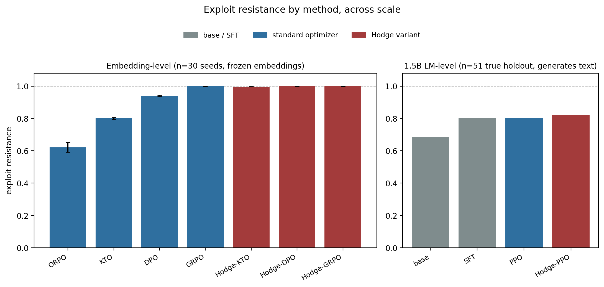

# Does Hodge-filtered preference optimization survive contact with a real generating LM?

*Track 1 · follow-up note · sources: 30-seed optimizer comparison, SGB-003/004/005b/005c*
*Status: DRAFT, version-controlled for provenance. Ships now with the 1.5B result and honest
caveats rather than waiting for the 7B run (SGB-006, not yet started) — see the "why ship now"
note in §5.*

> **⚠ ERRATUM (2026-07-31, SGB-044):** every exploit-resistance percentage in §2 below was
> computed by `evaluate_exploit_resistance`, which right-truncated the generation prompt to a
> hardcoded 256 tokens — a separate bug from the §3 RM-truncation fix, also found in
> `build_ppo_dataset` (PPO training queries) and `run_sft` (SFT training itself, which lost the
> actual training-target response, not just a marker). 100% of the 268 TRACE reference records
> exceed 256 tokens (median 987.5), 98.5% exceed 512. Code is fixed as of 2026-07-31
> (left-truncation + a shared, wider length budget); retraining SFT and both PPO variants at
> both scales is budgeted for August 2026, not yet run. Treat the table in §2 as unconfirmed,
> not retracted, until that rerun completes. See `.swarm/queue.md` SGB-044 and
> `feedback_geometry/README.md`.

> **⚠ CORRECTION (2026-09-18): the Hodge gain below does not survive held-out evaluation.**
> These numbers are in-sample ranking accuracy from a non-reproducible run (unseeded subsample of
> a 2,268-pair HH-RLHF + TRACE pool) that gave each sample another pair's Hodge target. A held-out
> re-test (`shared/results/optimizer_comparison_heldout_v1.json`, 5 splits × 30 seeds) finds
> Hodge-DPO 0.537 vs DPO 0.550 and Hodge-KTO 0.543 vs KTO 0.542 (split-level p ≥ 0.34), and a margin
> control reproduces the whole in-sample gain. Do not cite the table below as evidence for
> HodgePO. Details: `shared/results/README.md`.

## Summary

The embedding-level benchmark in this track (30 seeds, frozen sentence embeddings, an MLP
critic that never generates text) shows a large, clean Hodge advantage: filtering
Condorcet-cyclic preference pairs before optimizing improves exploit resistance by
+6.3% over DPO (d=6.52) and +24.5% over KTO (d=16.47). The natural next question is whether
that advantage survives when the "policy" is a real 1.5B language model that actually
generates text, is optimized with PPO rather than a closed-form preference loss, and is
evaluated by a learned reward model rather than by ranking accuracy over a frozen pair list.

**Headline, honest version:** yes, directionally, but the margin collapses by roughly an
order of magnitude and is not yet statistically distinguishable at the sample size we have.

| | embedding-level (n=30 seeds) | 1.5B LM-level (n=51 holdout) |
|---|---|---|
| baseline | DPO 0.940 | PPO 0.804 |
| Hodge variant | Hodge-DPO 0.9999 | Hodge-PPO 0.824 |
| gap | **+6.3%**, d=6.52, p<0.0001 | **+2.0%** (42/51 vs 41/51 — one example), not significant |



This note also folds in a materially important negative result along the way: the LM-level
pipeline's reward model was, for most of this investigation, training at chance level due to
a truncation bug (§3) — so any exploit-resistance number measured before the fix
(`sgb004_exploit_resistance_holdout.json`, the original SGB-004 run) is retracted and must not
be cited. Everything below post-dates the fix.

---

## 1. Setup

**Embedding-level benchmark** (already reported in this repo's README; recapped here for the
figure). DPO, GRPO, ORPO, KTO and their Hodge-filtered counterparts (Hodge-DPO, Hodge-GRPO,
Hodge-KTO), trained on 500 synthetic preference pairs + 1482 cross-pair kNN edges, embed_dim
384, 30 random seeds, `rm_epochs=50`. Hodge filtering reweights or discards pairs that
participate in a detected Condorcet cycle (harmonic component of the discrete Hodge
decomposition) before the optimizer sees them. Source:
`shared/results/optimizer_comparison_hodge_v3_30seed.json`.

**1.5B LM-level pipeline** (SGB-001→005c). Base model Qwen2.5-1.5B-Instruct + LoRA.
Four stages: SFT on TRACE counterfactual trajectories → reward model (Bradley-Terry, standard
or Hodge-reweighted) → PPO (custom clipped-surrogate loop, KL to frozen SFT reference) →
exploit-resistance eval. All four checkpoints (base, SFT, standard PPO, Hodge-PPO) are
evaluated on a **true, content-addressed 217/51 train/holdout split** (SHA-256 of
`seed:cache_key(record)`, seed=42) so the eval set was never seen by SFT, RM, or PPO training.
Source: `shared/results/finetune/sgb004_exploit_resistance_holdout_v2.json`.

The two setups are not a controlled scaling sweep of one variable — they differ in optimizer
family (closed-form preference loss vs. PPO), in what "policy" means (an MLP over frozen
embeddings vs. an autoregressive LM that generates text), and in what "exploit resistance"
measures (ranking accuracy over a frozen pair list vs. reward-model score on freshly generated
text). Read the comparison as "does the qualitative Hodge advantage survive a much less
favorable setting," not as a clean ablation.

---

## 2. Result — the LM-level Hodge advantage is directionally present, not yet confirmed

From `sgb004_exploit_resistance_holdout_v2.json`, n=51 true holdout trajectories:

| Model | Mean Reward | Exploit Resistance | n |
|---|---|---|---|
| base | 1.1432 | 68.63% | 51 |
| SFT | 1.9272 | 80.39% | 51 |
| PPO | 2.2174 | 80.39% | 51 |
| **Hodge-PPO** | **2.5873** | **82.35%** | 51 |

Two readings:

- **PPO now clearly beats SFT** (2.22 vs 1.93 mean reward) — this resolves an earlier anomaly
  (§3) where SFT appeared to beat both PPO variants, which turned out to be an artifact of a
  broken reward model rather than a real property of PPO.
- **Hodge-PPO edges out standard PPO on both metrics** — the first point in this whole
  investigation where the LM-level direction matches the embedding-level hypothesis. But
  82.35% vs 80.39% resistance is 42/51 vs 41/51: a one-example swing. The continuous
  mean-reward gap (0.37) is comparable in size to PPO's own gain over SFT (0.29), which is
  suggestive but per-example rewards were not persisted, so no paired significance test could
  be run from this data. Treat this as directionally positive, not as a confirmed replication
  of the embedding-level effect.

**What would raise confidence, cheaply:** persist per-example rewards next run (so a paired
test is possible without retraining anything), and/or add more holdout folds or repeated
training seeds — not further RM or PPO hyperparameter tuning, which is not the binding
constraint here.

---

## 3. Why the first LM-level attempt gave a nonsensical answer, and what we changed

The original SGB-004 run (`sgb004_exploit_resistance_holdout.json`, **retracted**, do not
cite) showed SFT beating *both* PPO variants — the opposite of what any RLHF pipeline should
produce, since PPO optimizes directly against the same reward the eval uses. Diagnosis:

Both reward models' Bradley-Terry training loss was stuck at ≈ log(2) ≈ 0.693 — chance level.
An undertraining hypothesis (5× epochs, 2× learning rate) changed the loss by less than 0.002:
a fix that produces literally no effect rules out that whole hypothesis class rather than
confirming it needs more of the same. The actual cause: TRACE `context_text` averages ~1010
tokens (median 947, max 2122); at `rm_max_length=512` the tokenizer's default *right*-truncation
cut the chat-templated sequence off **before the assistant turn even started**, so 49 of 50
sampled chosen/rejected training pairs were byte-identical after truncation. The RM had nothing
to discriminate — training on duplicate inputs, regardless of epochs or learning rate.

Fix: `tokenizer.truncation_side = "left"` in `build_rm_dataset` (preserves the differentiating
response tail), `rm_max_length` 512→1024, batch/grad-accum adjusted to fit the longer sequences
on an L4 GPU. Verified by scoring all 268 reference (ideal, exploit) pairs in the *exact*
training format (chat template + left-truncation — an earlier version of this same verification
script reimplemented formatting from scratch, got it wrong the same way, and gave misleading
numbers until the inconsistency was caught): both RMs went from 49%/45% (chance) to **100%
train and 100% holdout ranking accuracy**. Both PPO variants were then retrained against the
fixed reward models, producing the table in §2.

This is reported at length because it is the more load-bearing finding of the two: a positive
result computed on a chance-level reward model is not evidence of anything, in either
direction, and the sign of the original (retracted) result was actively misleading, not just
noisy.

---

## 4. Relationship to the embedding-level result

The embedding-level benchmark (§1) is not a placeholder for the LM-level one — it measures a
genuinely different quantity, and the two should be read as two separate, mutually informative
data points rather than one experiment repeated at two scales:

- Embedding-level: does reweighting away detected Condorcet cycles improve a downstream
  classifier's exploit resistance, holding the "generator" fixed (there is no generation; a
  frozen embedding is scored directly)? **Answer: yes, and dramatically** — this is the
  cleanest and most controlled result in the whole track.
- LM-level: does the same reweighting, applied to reward-model training, produce a policy that
  is harder to exploit *after PPO fine-tuning actually optimizes against it*? **Answer: weakly
  positive, unconfirmed at n=51.**

A prior attempt at a third framing — using the Hodge gradient-potential difference directly as
an auxiliary *feature* for ranking ideal vs. exploit text (SGB-005b), rather than as a
training-time reweight — found a much weaker honest signal (55-65% ranking accuracy, not
reliable at n=268) once an initial near-tautological 98% result was traced to a graph
construction that fed the classifier a near-certain direct edge asserting the answer. That
result is not folded into the headline table above; it argues against over-generalizing the
Hodge decomposition to any use that happens to be adjacent to the training-time result that
does work.

---

## 5. Limitations — the story we are not telling

1. **n=51 is genuinely small for the effect size in question.** The Hodge-PPO vs PPO resistance
   gap is one example. Do not describe this as "Hodge-PPO beats PPO" without the qualifier —
   it is "Hodge-PPO is ahead, not yet distinguishable from noise."
2. **One model scale, one base model.** Everything LM-level here is Qwen2.5-1.5B-Instruct.
   SGB-006 (scaling to 7B/8B on an A100) is queued but not started. The embedding-level result
   is scale-invariant by construction (it never runs a real LM), so it cannot substitute for a
   7B replication.
3. **Why ship this note now instead of waiting for the 7B run.** Per this project's standing
   preference for a steady publishing cadence over a single bigger-splash result, this note
   reports the 1.5B result with its caveats rather than holding it until SGB-006 lands. A
   follow-up note can fold in the 7B number when it exists; nothing here should be read as a
   final claim about scaling.
4. **The two benchmarks differ in more than scale**, per §1 — optimizer family, what "policy"
   means, and what the resistance metric measures all change at once. Do not present the two
   numbers in the summary table as points on a single controlled scaling curve.
5. **Both reward models saturated to ~0 training loss well before the full 10 epochs** (a sign
   of likely overfitting to 217 training pairs in an absolute sense), yet still generalized to
   100% holdout ranking accuracy and produced a sensible, monotonic downstream ordering
   (base < SFT = PPO < Hodge-PPO). This did not appear to hurt the result, but was not
   independently tuned down (e.g. via early stopping) to rule out as a confound.
6. **The reward-model truncation bug (§3) is a specific instance of a general risk**: any place
   in this pipeline that concatenates a long context with a short differentiating suffix and
   truncates by default risks silently destroying the differentiating content. The PPO
   query-prompt construction (`build_ppo_dataset`) still right-truncates at
   `sft_max_seq_length=512` — a milder version of the same risk — and has not yet been audited.

---

## 6. Provenance

| Claim | Value | Source |
|---|---|---|
| Hodge-DPO vs DPO | 0.9999 vs 0.940, d=6.52, p=2.45e-21 | `optimizer_comparison_hodge_v3_30seed.json` → `pairwise_tests["DPO vs Hodge-DPO"]` |
| Hodge-KTO vs KTO | 0.9964 vs 0.800, d=16.47, p=5.31e-34 | `optimizer_comparison_hodge_v3_30seed.json` → `pairwise_tests["Hodge-KTO vs KTO"]` |
| GRPO / Hodge-GRPO | both 1.000 ± 0.000 (ceiling) | `optimizer_comparison_hodge_v3_30seed.json` → `method_stats` |
| 1.5B exploit resistance table (§2) | base 68.63% / SFT 80.39% / PPO 80.39% / Hodge-PPO 82.35% | `shared/results/finetune/sgb004_exploit_resistance_holdout_v2.json` |
| RM truncation bug root cause + fix | ~1010-token contexts truncated before the assistant turn at rm_max_length=512, right-truncation | `shared/results/finetune/sgb004_exploit_resistance_holdout_v2.json` → `root_cause_fixed`; `shared/src/lm_finetuning.py::build_rm_dataset` |
| RM verification, post-fix | 100% train / 100% holdout ranking accuracy, both RMs | `shared/modal_finetune.py::score_pairs_rm`; scores in `shared/results/finetune/sgb005b_rm_scores{,_hodge}.json` |
| ~~original SGB-004 (SFT beats both PPO variants)~~ RETRACTED | — chance-level RM artifact | `shared/results/finetune/sgb004_exploit_resistance_holdout.json` (do not cite) |
| Hodge-as-featurizer (SGB-005b), not used in headline | 55-65% holdout accuracy, honest (non-tautological) variant | `shared/results/finetune/sgb005b_hodge_featurizer_result.json` |

Figure: `feedback_geometry/figures/sgb005_fig1_method_by_scale.png`, generated by
`feedback_geometry/figures/make_sgb005_figure.py` (loads both source JSONs directly, nothing
hardcoded).

Reproduce:

```bash
cd topics/shape_of_good_behavior
./venv/bin/python3 feedback_geometry/figures/make_sgb005_figure.py
```

**Target venue**: ICML 2026 follow-up artifact (per `feedback_geometry/README.md`'s venue
tracking: NeurIPS 2026 Theory/ML track or ICML 2027, backup JMLR / TAG-ML workshop). This note
is scoped as the minimum-viable follow-up for the open-model thread — the 7B scale-up (SGB-006)
and a paired significance test on more holdout data are the two items that would upgrade it
from "directionally positive" to a citable result.
